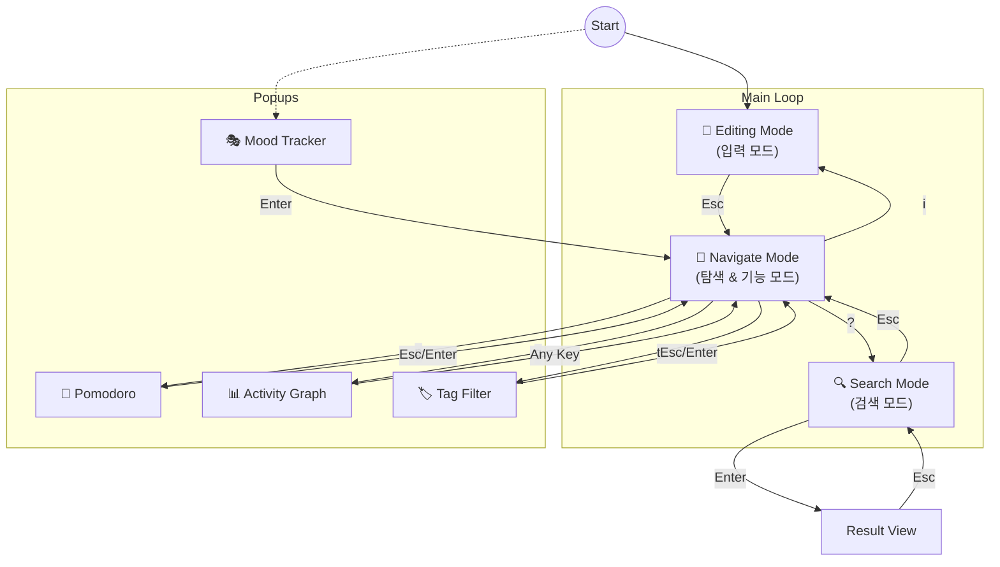

# sonomemo (소노메모) 🧠

**sonomemo**는 **ADHD를 위한 문맥 기록용 터미널 앱**입니다.

제가 필요해서 만들었습니다. 더 이상 서브라임 텍스트 플러그인 코드를 짜는건 질렸습니다. 클로드 코드에서 일 시키다가 알트 탭을 누르는것도 귀찮습니다. 그래서 제미나이의 도움을 좀 받았습니다. 사실 많이 받았습니다.


## ✨ 왜 굳이 이런걸?

- **🧠 만든 사람 기억력이 모자랍니다.**: 메모를 안하면 보통 까먹습니다. 안까먹는다구요? 좀 더 중요한걸 기억하시기 바랍니다. 제가 일하면서 몇시쯤에 이 아키텍처가 구리다고 생각했는지까지 기억해야할 필요는 없는 것 같습니다.
- **🍅 강제 환기 (뽀모도로)**: 기능이 뭐가 더 필요하지 싶어서 제미나이한테 물어봤더니 이런걸 제안했습니다. 사실 그냥 장난감 용도같기도 합니다.
- **🌱 시각적 피드백**: 깃허브의 잔디밭 비슷한걸 볼 수 있습니다.
- **📝 마크다운 기반**: 모든 데이터는 `YYYY-MM-DD.md` 형식의 로컬 텍스트 파일로 저장됩니다. 사실 마크다운일 필요가 있는진 모르겠어요. 제미나이가 그렇게 짜버렸습니다.
- **✅ 할 일 및 태그**: `- [ ]` 문법으로 할 일 자동 인식, `#태그`로 분류. 필요하면 적당히 검색할 수도 있습니다. 이게 제일 좋은듯.

이하 내용은 전부 제미나이가 적었습니다. 그냥 슥 보고 잘 썼네 싶어서 넣어놨습니다. 설명이 부족하다면 이슈로 올려주세요. 그대로 제미나이에 넘기겠습니다.

## 🗺️ 사용 가이드 (App Flow)

Sonomemo는 키보드 중심의 3가지 핵심 모드로 동작합니다.



### 1. 📝 Editing Mode (입력 모드)
> **"생각나는 것을 바로 적으세요"**
- 앱을 켜자마자 만나는 화면입니다.
- **Enter**: 메모 저장
- **Shift + Enter**: 줄바꿈 (멀티라인 입력)
- **Esc**: Navigate 모드로 전환

### 2. 🧭 Navigate Mode (탐색 모드)
> **"기록을 훑어보고 기능을 실행하세요"**
- 화살표 키(`↑`, `↓`)로 이전 기록을 스크롤합니다.
- `i`: 다시 입력 모드로 전환
- `?`: 검색 모드 진입
- `t`: 태그별로 모아보기
- `p`: 뽀모도로 타이머 설정 (25분 등)
- `g`: 활동 그래프 확인

### 3. 🔍 Search Mode (검색 모드)
- 검색어를 입력하고 Enter를 누르면 해당 단어가 포함된 메모만 필터링합니다.
- `Esc`: 검색 취소 및 Navigate 모드 복귀

## 🚀 설치 방법

### Crates.io를 통한 설치 (추천)
Rust가 설치되어 있다면 가장 간편한 방법입니다.
```bash
cargo install sonomemo
```

### 직접 빌드
```bash
git clone https://github.com/sonohoshi/sonomemo.git
cd sonomemo
cargo install --path .
```

## ⌨️ 단축키 요약

| 키 | 동작 (Navigate 모드 기준) |
|:--- |:--- |
| `i` | 입력 모드 전환 (메모 작성) |
| `?` | 검색 모드 진입 |
| `t` | 태그 필터링 |
| `p` | 뽀모도로 타이머 설정/해제 |
| `g` | 활동 그래프(잔디) 확인 |
| `q` | 앱 종료 |

## ⚙️ 설정 (Configuration) (New!)

Sonomemo v0.1.2부터는 `config.toml`을 통해 **단축키**와 **테마**를 자유롭게 변경할 수 있습니다.
실행 파일이 있는 경로에 `config.toml` 파일을 생성하여 사용하세요.

### 🎨 테마 및 단축키 설정 예시
```toml
# Sonomemo Configuration

[placeholders]
navigate = "키를 눌러 각종 기능을 사용하세요..."
editing = "오늘의 기록을 남겨보세요..."

# 키 바인딩 설정 (배열 형태로 입력)
[keybindings.navigate]
quit = ["q", "ctrl+q"]
tags = ["t"]
pomodoro = ["p"]

[keybindings.editing]
save = ["enter"]
newline = ["shift+enter"]
cancel = ["esc"]

# 테마 색상 설정 (색상명 또는 R,G,B)
[theme]
border_default = "Yellow"       # 기본 테두리
text_highlight = "100,60,0"     # 강조 배경색 (R,G,B)
todo_done = "Green"
todo_wip = "Red"
 mood = "LightRed"
```

> **Tip**: `examples/` 폴더에 다양한 테마 샘플(`Warm Sunshine`, `Ocean Blue` 등)이 준비되어 있습니다!


## 🛠️ 기여하기 (Contributing)
알아서 잘 해주시면 제미나이한테 넘기겠습니다.

## 📄 라이선스
MIT License (LICENSE 파일을 확인하세요)
